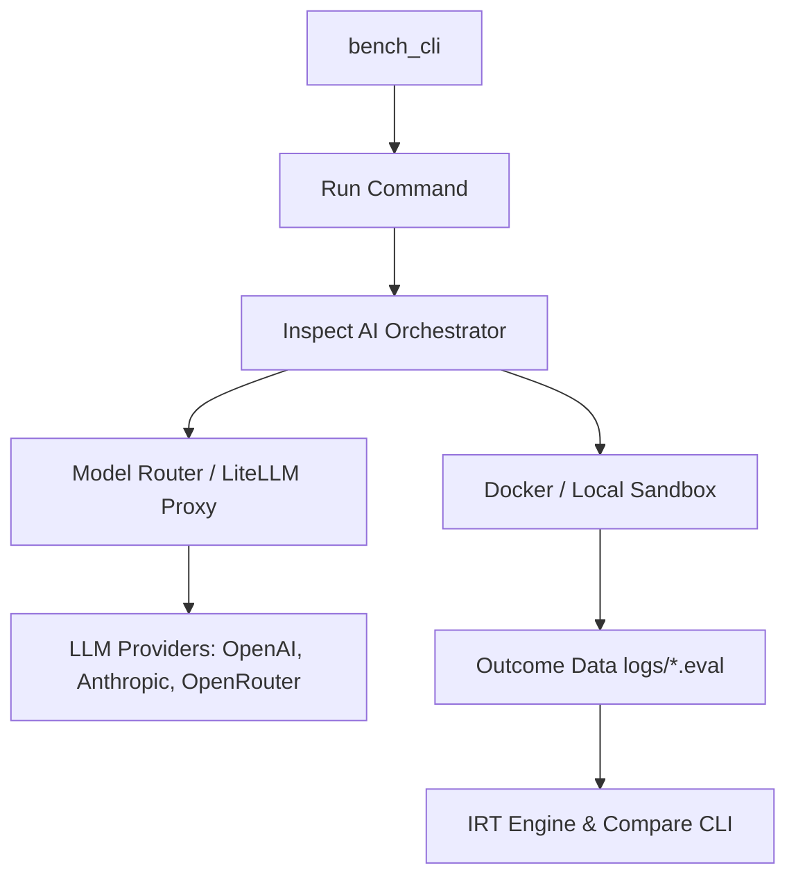

# Bench Architecture Guide

This document describes the design and internal architecture of **Bench**, a standalone LLM and agent evaluation system.

---

## 1. System Overview

**Bench** is built on top of **Inspect AI** (for evaluation orchestration) and **inspect-swe** (for software engineering sandboxing). It allows you to run deterministic and qualitative evaluation tasks against raw LLM APIs or autonomous agents.

---

## 2. Core Execution Sandbox

Bench supports two evaluation modes:
1.  **Model Evaluation**: Evaluates raw models using a single-turn `generate()` solver or multi-turn prompt loops.
2.  **Agent Evaluation**: Evaluates autonomous coding agents (like Claude Code, Codex, or Gemini CLI) by running them inside isolated sandboxes:
    *   **Docker Sandbox**: Standard mode for secure, isolated agent runtimes.
    *   **Local Sandbox**: Lightweight subshell execution for local debugging.

Tasks are packaged with reproducible file fixtures (in `tasks/`), which are mounted read-only inside the execution sandboxes.

---

## 3. LiteLLM Proxy & Routing

All LLM calls are routed through a local **LiteLLM proxy** to manage API credentials, enforce rate limits, handle retries, and map model aliases.

*   **Proxy Configuration**: Defined in the configuration file pointed to by the `LITELLM_CONFIG_PATH` environment variable (defaulting to `~/dev/litellm/config.yaml`).
*   **Virtual Tiers (Monikers)**: The proxy exposes moniker endpoints (`openai/default`, `openai/thinking`, `openai/heavy`, `openai/smart-router`) which route dynamically to appropriate backing APIs.
*   **Reconciliation**: The evaluation system intercepts moniker routing during data collection and reconciles the log's recorded identity to the actual concrete model (e.g. `minimax/minimax-m3`), preventing moniker alias collision in statistical reports.

---

## 4. The 4-Pillar Scoring Architecture

Every task produces four independent scores, representing performance and execution tradeoffs:

| Pillar | Metric | Calibration Source |
| :--- | :--- | :--- |
| **Correctness** | Score [0.0 - 1.0] | Defined via `verify_sh`, `llm_judge`, or `hybrid_scorer` |
| **Token Efficiency** | Ratio | Calibrated against `baselines/{task}/{model}.json` or task budgets |
| **Latency** | Ratio | Calibrated against execution time baselines |
| **Cost** | Ratio | Calibrated against model token price registries |

### Correctness Scorers
*   `verify_sh`: Runs a lightweight shell verification script (`verify.sh`) inside the task sandbox to check deterministic outcomes (e.g., file contents, compilation flags, test passing rates).
*   `llm_judge`: Employs a separate judge model (`openai/judge`) with task-specific rubrics. It uses a **discrete 5-point scale** (`0`, `2.5`, `5`, `7.5`, `10`) to reduce inter-run variance. The raw score is normalized to `0.0 - 1.0` by dividing the rubric score by 10.
*   `hybrid_scorer`: A weighted combination of `verify_sh` (typically 70%) and `llm_judge` (typically 30%).

---

## 5. Statistical Analyses & Recommendations

Bench implements advanced mathematical ranking systems to group, score, and select models:

1.  **Bayesian Item Response Theory (IRT)**:
    *   Estimates model latent capabilities ($\theta$) along with 95% Bayesian credible intervals (CIs).
    *   Estimates task difficulties ($b$) and discriminations ($a$) to identify low-value tasks that should be culled.
    *   For mathematical details, see [STATISTICAL-SCORING-AND-IRT.md](STATISTICAL-SCORING-AND-IRT.md).
2.  **Pareto Frontier Selection**:
    *   Identifies optimal models based on the trade-offs between latent capability ($\theta$), token cost, and execution speed.
    *   Filters out dominated models and highlights Pareto-optimal choices.

---

## 6. Directory Layout & CLI Packages

*   `bench_cli/`: Core command-line tool package.
    *   `run/`: Orchestration scripts for launching evaluations.
    *   `compare/`: Pivot-table generators for reporting raw metrics.
    *   `irt/`: The PyMC 2PL IRT fitting engine and CLI commands.
    *   `recommend/`: Preset routing algorithms (best, cheap-fast, balanced) and Pareto-frontier filters.
    *   `results/`: Automatic markdown model card generators (`results/*.md`).
*   `tasks/`: Fixtures, prompts, and verification scripts for the 36 evaluation tasks.
*   `scorers/`: Calibrated task token and latency budgets.
*   `baselines/`: Reference runs for ratio normalization.
*   `logs/`: Binary Inspect `.eval` logs and execution records.
